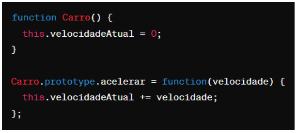

# Instruções

- Faça uma cópia deste arquivo .md para um repositório próprio
- Resolva as 6 questões objetivas assinalando a alternativa correta
- Resolva as 4 questões dissertativas escrevendo no próprio arquivo .md
  - lembre-se de utilizar as estruturas de código como ``esta aqui com ` `` ou
```javascript
//esta aqui com ```
let a = "olá"
let b = 10
print(a)
```
- Resolva as questões com uso do Visual Studio Code ou ambiente similar.
- Teste seus códigos antes de trazer a resposta para cá.
- Cuidado com ChatGPT e afins: entregar algo só para ganhar nota não faz você aprender e ficar mais inteligente. Não seja dependente da máquina!
- ao final, publique seu arquivo lista_01.md com as respostas em seu repositório, e envie o link pela Adalove. 

# Questões objetivas

**1)** O que o código a seguir faz?


Escolha a opção que responde corretamente:

a) Imprime os números pares de 1 a 10.

b) Imprime os números ímpares de 1 a 10.

c) Imprime os números pares de 2 a 10.

d) Imprime os números ímpares de 2 a 10.

```javascript
A alternativa correta é a levra c.
```

______

**2)** Identificar a linha que falta no código para criar uma classe Veiculo com atributo marca, e uma classe Carro que herda de Veiculo com um método ligar(). 


No lugar onde está escrito “// linha” qual das opções abaixo deve estar para funcionar corretamente o código?

A) let carro = new Carro("Toyota");

B) let ligar = new ligar("Toyota");

C) class Moto extends Veiculo {};

D) carro1.ligar();

```Javascript
A alternativa correta é a letra a.
```

______

**3)** Qual é o valor de resultado após a execução deste código?


Escolha a opção que responde corretamente:

A) 18

B) 16

C) 14

D) 12

```Javascript
A alternativa correta é a letra a.
```

______

**4)** Como você criaria um método `acelerar()` em uma classe `Carro`, que recebe um parâmetro `velocidade` e o adiciona a um atributo `velocidadeAtual`?

A) 

B) 

C) 

D) 

```Javascript
A alternativa correta é a letra a.
```
______

**5)** Qual a forma correta de definir uma classe Carro em JavaScript, com um método ligar() e um atributo marca?

A) 

B) 

C) 

D) 

```Javascript
A alternativa correta é a letra a.
```
______

**6)** Observe o código abaixo:


Qual será a saída do código acima?

A) "Olá, meu nome é João. Olá, meu nome é Maria."

B) "Olá, meu nome é ."

C) "João Maria"

D) "undefined undefined"

```Javascript
A alternativa correta é a letra a.
```
______

# Questões dissertativas

**7)** Vamos criar um programa em JavaScript para entender classes, métodos e atributos!
Classe Animal:
- Crie uma classe chamada Animal.
- Adicione dois atributos: nome e idade.
- Adicione um método chamado descrever() na classe Animal.
  - Este método deve exibir no console uma descrição do animal com seu nome e idade.

Criando e manipulando Animais:
- Crie dois objetos da classe Animal: um chamado "cachorro" e outro "gato", com idades distintas.
- Para cada animal, chame o método descrever() para ver a descrição no console.

Dica: Utilize `console.log()` para exibir as informações!

```Javascript

//criando classe
class Animal {
  //criando atributos para a classe
    constructor(nome, idade){
        this.nome = nome;
        this.idade = idade;
    }

//criando método para a classe que vai definir a impressão do código
descrever() {
        console.log(`Eu sou um ${this.nome} e tenho ${this.idade} anos!`);

    }

}

//criando duas variáveis e definindo seus valores
let animal1 = new Animal("Cachorro", 15);
let animal2 = new Animal("Gato", 4);

//chamando a impressão das duas variáveis
animal1.descrever();
animal2.descrever();

```

______

**8)** Nos últimos dias tivemos a oportunidade de ter contato com Programação Orientada a Objetos, e tivemos contato com o tema "herança". Herança é um princípio de orientação a objetos, que permite que classes compartilhem atributos e métodos. Ela é usada na intenção de reaproveitar código ou comportamento generalizado ou especializar operações ou atributos. Então vamos praticar esse conteúdo nessa questão.
Vamos criar um programa em JavaScript para entender classes, métodos, atributos e herança!

Classe Animal:
- Crie uma classe chamada Animal.
- Adicione dois atributos: nome e idade.
- Adicione um método descrever() que exiba no console uma descrição do animal com seu nome e idade.

Classe Gato (Herda de Animal):
- Crie uma classe chamada Gato que herda da classe Animal.
- Adicione um atributo extra cor específico para gatos.
- Adicione um método miar() que exiba no console o som que um gato faz.

Criando Animais:
- Crie dois objetos da classe Animal: um chamado cachorro e outro gato, com idades distintas.
- Para o gato, também defina a cor.

Chamando os Métodos:
- Para cada animal, chame o método descrever() para ver a descrição no console.
- Para o gato, chame o método miar() para "ouvir" o som que ele faz (é também para ver o som no console).

Dica: Utilize console.log() para exibir as informações!


```Javascript

//criando classe
class Animal {
  //atributos da classe
    constructor(nome, idade ) {
      this.nome = nome;
      this.idade = idade;
    }
  
  //método para definir a impressão
    descrever() {
      console.log(`Olá, eu sou um ${this.nome} e tenho ${this.idade} anos.`);
    }
  }
  
  //criando classe herdeira de animal
  class Gato extends Animal {
    //adicionando atributos herdados e nao herdados
    constructor(nome, idade, cor) {
      super(nome, idade);
      this.cor = cor;
    }
  
    //método para imprimir o miado e a cor
    miar() {
      console.log(`Sou ${this.cor}, miau!`);
    }
  }
  
  //definindo variável e chamando a impressão dela
  let animal1 = new Animal("cachorro", 12);
  animal1.descrever();

  //segunda variável definida que vai ser chamada duas vezes 
  let gato1 = new Gato("Gato", 6, "preto");
  gato1.descrever(); 
  gato1.miar();

```

______

**9)** Vamos criar um programa em JavaScript para somar notas!

Classe SomadorDeNotas:
- Crie uma classe chamada SomadorDeNotas.
- Adicione um atributo total inicializado com 0 para armazenar a soma das notas.

Método adicionarNota:
- Adicione um método chamado adicionarNota(nota) na classe SomadorDeNotas.
- Este método deve receber um parâmetro nota e somá-lo ao atributo total.

Criando o Somador e Adicionando Notas:
- Crie um objeto da classe SomadorDeNotas, chamado somador.
- Utilize o método adicionarNota(nota) para adicionar algumas notas ao somador.

Chamando o Método para Ver o Total:
- Após adicionar todas as notas, chame um método verTotal() para exibir o total das notas adicionadas.

Dica: Utilize console.log() para exibir as informações!

```Javascript

//criando classe
class SomadorDeNotas{
  //adicionando atributo de valor total com valor de início nulo
    constructor(valorTotal = 0){
        this.valorTotal = valorTotal;
    }
    //método pra somar as notas
    adicionarNota(nota){
        this.valorTotal += nota;
    }
    //método para definir o que imprimir
    verTotal() {
        console.log(`A sua nota nota total é ${this.valorTotal}`);
    }
}

//variável da classe
let somador = new SomadorDeNotas();

//adicionando as notas
somador.adicionarNota(7);
somador.adicionarNota(8);
somador.adicionarNota(10);

//cahamando para imprimir
somador.verTotal();

```


______

**10)** Imagine que você está criando um programa em JavaScript para uma escola. Neste programa, existem diferentes tipos de funcionários, cada um com suas próprias características. Considere as seguintes classes:

Funcionário:
- atributo: Nome
- atributo: Idade
- atributo: Salário base
- método: calcularSalario() - Este método calcula o salário total do funcionário. Para cada tipo de funcionário, o cálculo será diferente.

Professor (herança de Funcionário):
- atributo: Disciplina
- atributo: Horas de aula por semana
- método: calcularSalario() - Para calcular o salário do professor, multiplicamos suas horas de aula pelo valor da hora/aula.

Agora, sua tarefa é escrever um código em JavaScript que crie as classes Funcionário e Professor, com suas características e métodos descritos acima. Depois de criar as classes, crie:
- Dois objetos do tipo Professor com informações fictícias.
- Para cada objeto, chame o método calcularSalario() e mostre o salário calculado no console.

Certifique-se de explicar cada parte do código utilizando comentários, explicando para que serve cada atributo e método, bem como a lógica por trás do cálculo de salário para o tipo de funcionário Professor.

```Javascript

//criar classe
class Funcionario{
    //adicionando atributos
    constructor(nome, idade, salarioBase){
        this.nome = nome;
        this.idade = idade;
        this.salarioBase = salarioBase;
    }
    //criação de método nulo
    calcularSalario() {
        return 0;
    }
}

//criando mais uma classe que herda da classe funcionário 
class Professor extends Funcionario{
    constructor(nome, idade, salarioBase, disciplina, horas){
        super(nome, idade, salarioBase);
        this.disciplina = disciplina;
        this.horas = horas
    }

    //criando mais um étodo para calcular o salário
    calcularSalario(horasAula, total){
        //definindo total como a multiplicação das horas semanais pelo valor das aulas e multiplicando pelas 4 semanas do mês
        total = horasAula *  this.horas * 4;
        //definindo o total
        this.total = total;
        //adicionando o que eu quero que o código imprima
        console.log(`O salário base da escola é de ${this.salarioBase}. Entretanto, o salário de ${this.nome}, que tem ${this.idade}, é professor da disciplina de ${this.disciplina} e trabalha por ${this.horas} horas semanais é de R$ ${this.total} mensais.`)
    }
}
//caracterizando os professores com seus dados
let professor1 = new Professor("Aurélio", 63, 1412, "Física", 20);
let professor2 = new Professor("André", 43, 1412, "Geografia", 45);

//chamando a resposta dos professores e adicionando o valor das suas horas
professor1.calcularSalario(45);
professor2.calcularSalario(60);

```